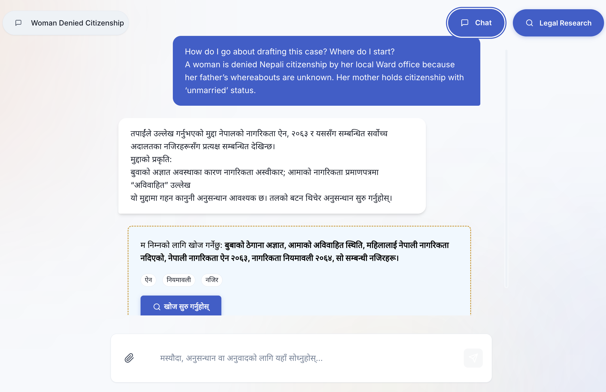
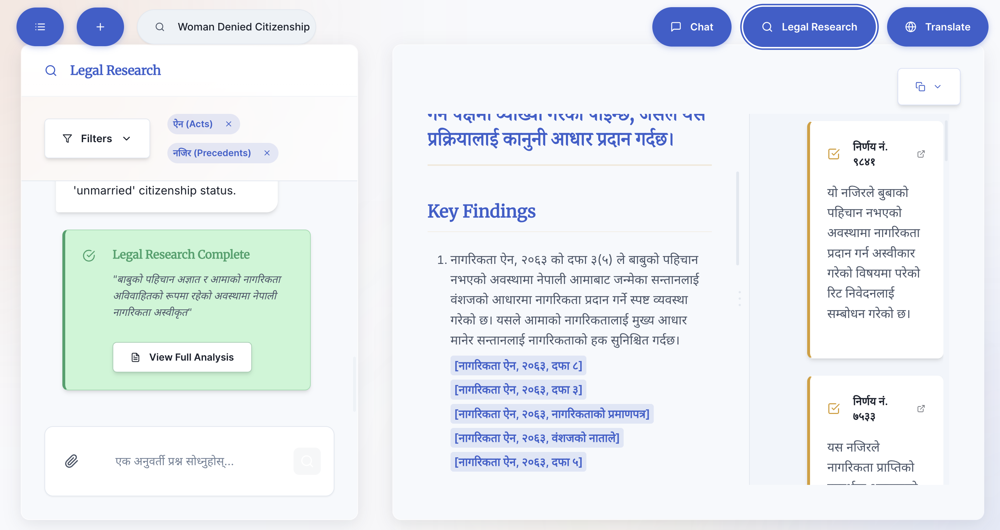
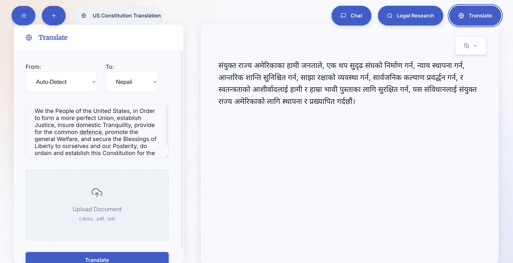

# FiradPatra  
*For the Architects of Nepali Law*

FiradPatra is a legal research tool designed to amplify structure and precision in navigating Nepali statutes and case law. It empowers legal professionals—lawyers, researchers, and students—by providing simplified access to legal research, citation references, and analytical tools tailored specifically to Nepali law.

---

## 🔍 Features

## 🧠 Intelligent Nepali Legal Research  
FiradPatra goes beyond keywords—it understands the legal intent behind your query. It uses Artificial Intelligence to search an extensive, secure database of Nepali laws, precedents (नजिर), and regulations, and delivers precise, well-structured legal analysis tailored to your question.

## 📝 Legal Drafting Assistance  
Draft with confidence. Upload your legal documents and let our AI assist with clarity, compliance, and citation accuracy.

## 🌐 Court-Ready Translation  
Translate legal documents between 20+ languages with legal-grade accuracy. Trained on legal terminology and document structure, FiradPatra ensures nuanced translations with formatting preserved—ready for use in legal proceedings.

---

### 🌐 Live at: [firadpatra.com](https://firadpatra.com)  

> **Note:** Access is currently limited. You can [sign up for the waitlist on our website](https://firadpatra.com).

Join our Discord for support, discussions, and updates

---

## 📸 Screenshots

### Chat and Drafting Assistance

### Legal Research  

### Court-Ready Translation  

---

Led and developed by [@bvrvl](https://github.com/bvrvl) as part of [**Kritim Labs**](https://github.com/kritim-labs), an independent creative technology studio.

*FiradPatra is a proprietary project developed by Kritim Labs. The codebase is not open source. All designs, features, and content are for demonstration purposes only.*

© 2025 Kritim Labs. *FiradPatra™*. All rights reserved.